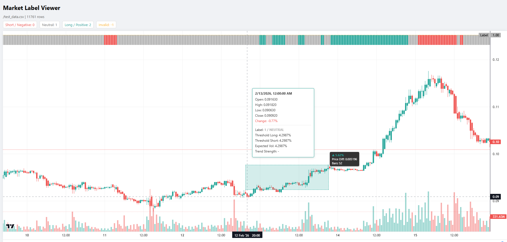
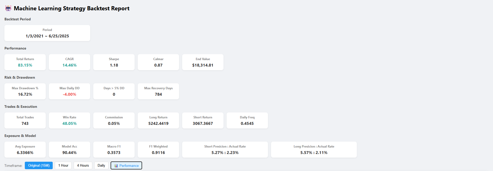
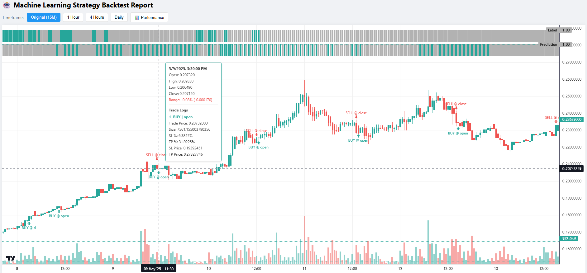
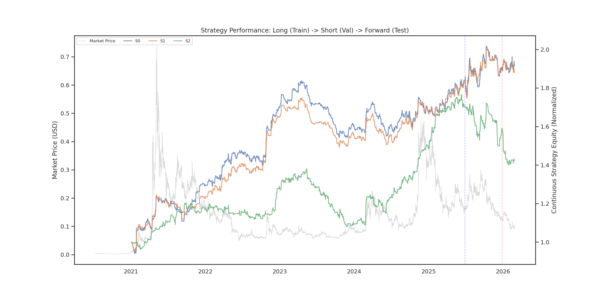

# Machine Learning Trading System

An end-to-end quantitative trading system built around market data processing, feature engineering, machine-learning signal generation, backtesting, risk control, and visualization.

## Overview
Core workflow includes:

1. Downloading and preprocessing historical market data.
2. Building relative, volatility-aware, and market-state-aware features.
3. Training machine-learning models for long and short signal prediction.
4. Evaluating model outputs with both ML metrics and trading-oriented metrics.
5. Converting model predictions into strategy actions.
6. Running backtests with fees, drawdown, position logic, and risk constraints.
7. Visualizing model signals and strategy behavior through a local UI.

## Running
### 1. Data process
Prepare market data for model training, including data cleaning, feature engineering, labeling, and dataset generation.
```bash
cd data_process
python download_binance_history.py #data format example: data_process/data_format_example.csv
python preparation.py   #data process and labeling
```
**Label Visualization (Optional)**
An optional web-based tool for inspecting generated labels together with market price, thresholds, and other labeling details, making it easier to validate and debug the labeling process.
Make sure `CONF_DF = 'to_csv'` in `data_process/common.py`.
```bash
cd data_process/label_viewer
npm install
npm run dev
```
<p align="left">

</p>

### 2. Train model
Train machine learning models using the prepared datasets and save the trained models and evaluation results.
```bash
cd model    
python train.py
```

### 3. Backtesting 
Evaluate trained models with a realistic trading simulation and generate performance statistics.
```bash
cd trade/bt
python simulation.py
```

### 4. Web UI:
Launch the interactive dashboard for visualizing strategy performance, trading history, and market data.
**Backend**
```bash
cd financial-ml-system 
uvicorn UI.backend.main:app --host 0.0.0.0 --port 8000
```
**Frontend**
```bash
cd UI/quant-ui
npm install
npm run dev
```

**Performance metrics**
<p align="left">

</p>

**trading details view**
<p align="left">

</p>

### 5. Batch Experiments
Run large-scale experiments to compare different models, features, labeling methods, and trading strategies.
```bash
cd experiment
python batch_train.py
python batch_simulation.py
```
**Analyze Experiment Results**
```bash
python trigger_direction_report_view.py
```
**Key Strategy Indicators**

| Num | Hash | CAGR | Sharpe | Calmar | Max_DD | DailyFreq | WinRate | RC_Median | RC_PosRatio | MAX_DD_DAYS |
|---:|:---------|----:|-------:|--------:|-------:|----------:|--------:|----------:|------------:|------------:|
| 0 | 83195b72 | 0.14 | 1.18 | 0.87 | 16.72 | 0.45 | 0.48 | 2.99 | 0.78 | 784 |
| 1 | b4610fc1 | 0.14 | 1.23 | 0.94 | 15.22 | 0.39 | 0.47 | 3.37 | 0.78 | 716 |
| 2 | f45ba8c4 | 0.13 | 1.10 | 0.57 | 22.09 | 0.37 | 0.50 | 2.53 | 0.65 | 541 |
| 3 | b3e6aed2 | 0.12 | 1.17 | 0.99 | 11.96 | 0.18 | 0.50 | 2.15 | 0.76 | 560 |
| 4 | 9bf618fa | 0.10 | 0.80 | 0.34 | 30.36 | 0.54 | 0.48 | 2.58 | 0.67 | 779 |
| 5 | e0bc3078 | 0.10 | 0.74 | 0.44 | 22.41 | 0.59 | 0.44 | 1.96 | 0.78 | 910 |
| 6 | e5db40c3 | 0.09 | 0.75 | 0.66 | 13.45 | 0.31 | 0.47 | 2.22 | 0.80 | 416 |
| 7 | a03e22ff | 0.09 | 0.65 | 0.41 | 21.09 | 0.48 | 0.48 | 1.61 | 0.64 | 648 |
| 8 | 90b398b9 | 0.09 | 0.95 | 1.14 | 7.52 | 0.16 | 0.50 | 2.20 | 0.82 | 378 |
| 9 | e5db40c3 | 0.09 | 0.70 | 0.50 | 17.14 | 0.32 | 0.46 | 0.85 | 0.67 | 608 |

**Equity Curve and Market Price**
<p align="left">

</p>

## Project Structure

```text

├── data_process/          # Data download, cleaning, feature construction, preprocessing
├── model/                 # Model training, evaluation, feature selection, experiment scripts
│   ├── models/            # Model definitions
│   └── tasks/             # Training and experiment task definitions
├── trade/                 # Backtesting, market interface, strategy execution logic
│   ├── bt/                # Backtest-related modules
│   ├── market/            # Market data / living trading interface
│   └── strategy/          # Strategy rules, signal handling, position logic
├── experiment/            # Experiment comparison, reports, visualization, analysis scripts
├── UI/                    # Local UI for inspecting results and workflow outputs
│   ├── backend/           # Backend service
│   └── quant-ui/          # Frontend interface
├── utils/                 # Shared utilities
├── requirements.txt       # Python dependencies
└── Readme.md              # Project documentation
```

## Key Features

### Data Pipeline

The data pipeline handles historical market data collection, cleaning, alignment, and preprocessing.

Supported raw market fields include:

- `open`, `high`, `low`, `close`
- `volume`
- `number_of_trades`
- `quote_asset_volume`
- `taker_buy_base_volume`
- `taker_buy_quote_volume`

The pipeline is designed to reduce data leakage and alignment errors, which are especially important in time-series modeling and backtesting.

### Feature Engineering

The project builds market features from price, volume, volatility, candle structure, and technical indicators.

Feature directions include:

- Price-relative features.
- Volume and turnover features.
- Taker buy/sell pressure features.
- Volatility-normalized features.
- Candle body / wick structure features.
- KDJ / MFI / CFM-style technical features.
- Feature correlation and factor analysis.

A key design principle is that model inputs should rely on **relative information** rather than raw absolute values whenever possible. This improves robustness across assets, price levels, and market regimes.

### Scaling and Normalization

Financial time series are highly non-stationary, so preprocessing is treated as part of the modeling design rather than a mechanical step.

Explored preprocessing methods include:

- Relative change from a reference timestamp.
- Z-score normalization.
- Robust scaling.
- Ratio-based scaling.
- Log transformation.
- Rank / quantile normalization.
- Feature-group-aware normalization.

The project pays special attention to normalization mistakes that can damage signal quality, such as mixing feature means and base-feature standard deviations incorrectly, or using absolute thresholds that do not adapt to volatility.

### Machine-Learning Signal Models

The model layer is responsible for generating directional trading signals.

Current modeling directions include:

- Long-vs-other classification.
- Short-vs-other classification.
- Separate long and short models to reduce coupling.
- Feature selection and feature-combination experiments.
- Confidence-based signal filtering.
- Analysis of the gap between classification metrics and strategy performance.

The project separates long and short prediction because upward and downward movements often have different market mechanisms.

### Backtesting and Strategy Logic

The backtesting layer evaluates whether model outputs can become realistic trading behavior.

Focus areas include:

- Signal-driven entry logic.
- Fixed holding-period experiments.
- Minimum holding time plus signal refresh.
- Early exit on reverse signals.
- Path-dependent holding logic.
- Stop-loss and ATR-based risk control.
- Position sizing based on volatility.
- Fee-adjusted performance.
- Drawdown analysis.
- Long/short separated performance analysis.

### Local UI

The repository includes a local UI for inspecting experiments and strategy behavior.

The UI is used to:

- View backtest results.
- Compare experiment reports.
- Inspect model signals.
- Visualize whether signals match market movement.
- Support faster iteration during model and strategy development.

## Validation Methods

### Walk-Forward Analysis

Out-of-sample testing is used to simulate how a model would be updated over time without using future information.

### Cross-Asset Validation

A signal should not only work on a single asset by accident.

Example workflow:

```text
Optimize on ETH
Test on BTC, SOL, BNB, DOGE, or other assets
```

If a parameter only works on one asset and fails everywhere else, it is likely overfitted.

### Multi-Timeframe Validation

Signals can also be tested across different K-line periods to check whether they capture a robust market pattern or only fit one sampling interval.

## Environment
```bash
Python >= 3.10
pip install numpy scipy pandas scikit-learn matplotlib seaborn plotly notebook jupyterlab ipykernel statsmodels xgboost lightgbm tqdm joblib requests beautifulsoup4 pytorch-ignite  colorlog backtrader pyarrow numba GitPython ignite
pip install MetaTrader5 pybit    # for live trading
```
> Some entry points may change as the system evolves.

## Technical Highlights

This project demonstrates practical AI/ML engineering through:

- Financial time-series feature engineering.
- Non-stationary data preprocessing.
- Supervised learning for directional signal generation.
- Long/short separated modeling design.
- Experiment tracking and model evaluation.
- Backtesting with realistic trading constraints.
- Risk-control logic and drawdown analysis.
- Full pipeline implementation from data to model to strategy to visualization.

## Contribution Policy

This is a personal project and is not currently open to external code contributions.

## Disclaimer

This repository is for technical demonstration only.

It is not financial advice, investment advice, or a recommendation to trade. Quantitative trading involves substantial risk. Machine-learning models can overfit historical data, fail under regime changes, and produce misleading backtest results. Any live trading decision requires independent validation, realistic cost assumptions, strict risk control, and personal responsibility.

## License

No open-source license is currently specified. Unless a license is added, all rights are reserved by the author.


