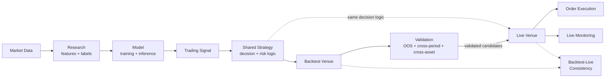
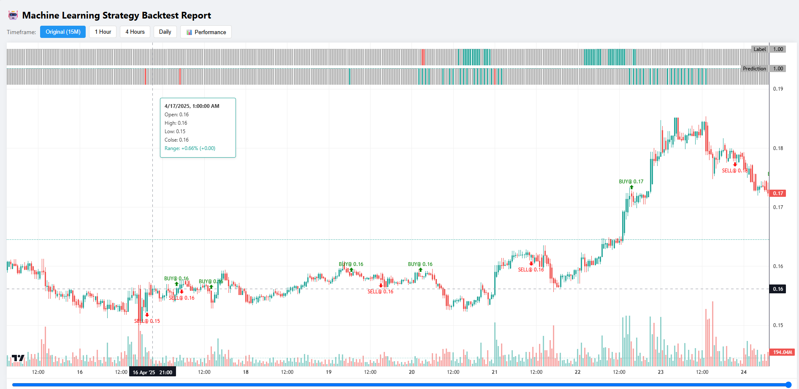
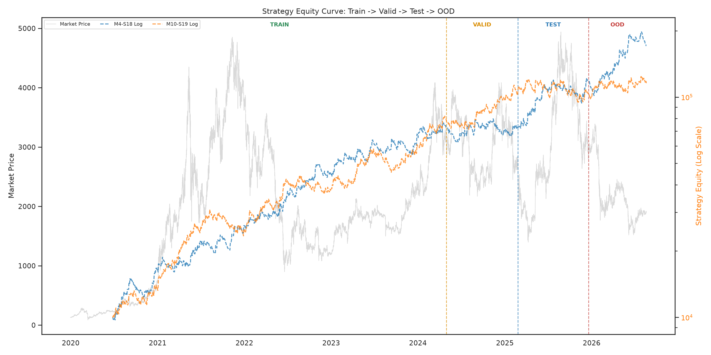
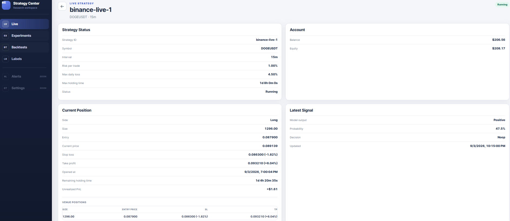

# Machine Learning-Based Quantitative Research and Trading System

A research-oriented platform for developing, validating, and operating machine-learning-based systematic trading strategies.

The project is organized around a single progression:

**research → validation → live**

The same strategy and risk logic is shared across backtest and live environments, while market-data feeds and venue adapters isolate environment-specific behavior. The goal is not only to produce backtest results, but to build a research workflow that makes assumptions testable, validation repeatable, and deployment behavior comparable with historical simulation.

---

## Research Workflow


```mermaid
flowchart LR
    DATA["Market Data"] --> RESEARCH["Research<br/>features + labels"]
    RESEARCH --> MODEL["Model<br/>training + inference"]
    MODEL --> SIGNAL["Trading Signal"]
    SIGNAL --> STRATEGY["Shared Strategy<br/>decision + risk logic"]

    STRATEGY --> BACKTEST["Backtest Venue"]
    BACKTEST --> VALIDATION["Validation<br/>OOS + cross-period + cross-asset"]
    VALIDATION -->|"validated candidates"| LIVE["Live Venue"]

    STRATEGY -.->|"same decision logic"| LIVE
    LIVE --> EXECUTION["Order Execution"]
    LIVE --> MONITORING["Live Monitoring"]

    BACKTEST -.-> CONSISTENCY["Backtest-Live<br/>Consistency"]
    LIVE -.-> CONSISTENCY
```

The research layer turns market data into features, labels, models, and trading signals. The strategy layer converts signals into trading decisions under explicit position and risk rules. Backtest venues simulate market state and execution, while live venues adapt the same strategy interface to broker and exchange APIs.

Selected strategies are evaluated through out-of-sample, cross-period, and cross-asset tests before live deployment. Live market data, model predictions, strategy decisions, and execution traces can then be recorded and replayed for consistency analysis.

Architecture details:

- [Model architecture](model/readme.md#architecture)
- [Trading architecture](trade/readme.md#trading-architecture-one-strategy-multiple-venues)
- [Strategy Center architecture](UI/STRATEGY_CENTER.md)

---

## Research Components

### 1. Market Data and Preprocessing

The data pipeline handles historical market data collection, cleaning, alignment, and preprocessing.

Supported market fields include:

- `open`, `high`, `low`, `close`
- `volume`
- `number_of_trades`
- `quote_asset_volume`
- `taker_buy_base_volume`
- `taker_buy_quote_volume`

Time-series preprocessing is treated as part of the research design rather than a mechanical step. Particular attention is paid to timestamp alignment and normalization choices that may introduce leakage or distort signal behavior.

Explored preprocessing methods include:

- relative change from a reference timestamp
- Z-score normalization
- robust scaling
- ratio-based scaling
- log transformation
- rank / quantile normalization
- feature-group-aware normalization

### 2. Feature and Label Research

Feature research focuses on market information that can remain comparable across price levels, assets, and regimes.

Current feature directions include:

- price-relative and momentum features
- volume and turnover features
- taker buy/sell pressure
- volatility-normalized features
- candle body / wick structure
- technical indicators such as KDJ, MFI, and CFM-style features
- feature correlation and factor analysis

A key design principle is to prefer **relative information** over raw absolute values where appropriate, improving comparability across assets and regimes.

Label design and trading logic are evaluated together because a predictive target is only useful when its horizon and assumptions can be translated consistently into trading behavior.

### 3. Machine-Learning Signal Models

The model layer generates directional trading signals.

Current modeling directions include:

- long-vs-other classification
- short-vs-other classification
- separate long and short models
- feature-selection and feature-combination experiments
- confidence-based signal filtering
- comparison between predictive metrics and realized strategy performance

The project deliberately compares simple and complex models rather than assuming higher model complexity produces better trading results.

### 4. Strategy and Risk Logic

The strategy layer converts model outputs into executable decisions.

Research areas include:

- signal-driven entries
- fixed holding-period experiments
- minimum holding time plus signal refresh
- early exits on reverse signals
- path-dependent holding logic
- stop-loss and ATR-based risk controls
- volatility-aware position sizing
- fee-adjusted performance
- drawdown and recovery analysis
- separated long/short performance analysis

Strategy and risk logic are shared across historical simulation and live execution.

---

## Validation and Robustness

Validation is treated as a core part of the research process rather than a final backtest step.

### Out-of-Sample Evaluation

Models and strategies are evaluated on data excluded from training and parameter selection. Train, validation, and test behavior are compared to identify unstable models, parameter sensitivity, and obvious overfitting.

### Cross-Period Validation

Selected models can be frozen and evaluated on later market periods without retraining. This tests whether the learned relationship persists outside the original development window.

### Cross-Asset Validation

Selected configurations can also be evaluated on different assets without re-optimizing the model or strategy.

Example workflow:

```text
Develop / select on ETH
Freeze model and strategy configuration
Evaluate on BTC, SOL, BNB, DOGE, or other assets
```

The purpose is to test whether performance reflects a repeatable market relationship rather than asset-specific historical noise.

### Multi-Timeframe Validation

Signals can be evaluated across different bar intervals to test whether they depend on one specific sampling frequency.

### Leakage and Alignment Checks

The research pipeline explicitly guards against common time-series errors such as:

- use of full-sample statistics during preprocessing
- feature / label timestamp misalignment
- prediction lookahead
- inconsistencies between research and execution timing

Bar-by-bar replay is used to verify that features and model predictions available at each historical timestamp match what would have been available in live trading.

### Backtest-Live Consistency

Historical data can be replayed through the live feed and compared with backtest outputs.

Conversely, market data and model predictions recorded during live trading can be replayed through the research environment. This bidirectional workflow is used to compare:

- market inputs
- model signals
- strategy decisions
- execution traces

across research and deployment environments.

### Deployability Analysis

Evaluation extends beyond return and Sharpe. The system also tracks whether a strategy is practically deployable through metrics such as:

- maximum drawdown
- drawdown duration
- recovery time
- trading frequency
- win rate
- risk per trade
- performance under unfavorable market periods

---

## Example Results

### Strategy Center

The Strategy Center combines label inspection, backtest analysis, experiment comparison, and live monitoring in one interface.

<p align="left">

</p>

<p align="left">

</p>

### Strategy Indicators

A small example of strategy-level evaluation output:

| Num | Model | Sharpe | Calmar | MaxDD | Freq | Win | DDDays | Risk | Avg Pct Gross |
|:---|:---|---:|---:|---:|---:|---:|---:|---:|---:|
| M2-S15 | Trans | 1.67 | 2.72 | 21.92 | 0.61 | 0.34 | 190 | 0.01 | 0.2388 |
| M8-S16 | LSTM | 1.26 | 1.83 | 32.01 | 0.38 | 0.36 | 266 | 0.02 | 0.1161 |
| M9-S17 | Trans | 1.76 | 2.81 | 20.73 | 0.63 | 0.37 | 122 | 0.01 | 0.1021 |

<p align="left">

</p>

### Cross-Period / Cross-Asset Results

The same original model and strategy configuration developed on `ETHUSDT 15m` were evaluated on different periods and assets without retraining or parameter re-optimization. All columns use the same long-period evaluation scope.

| Num | Hash | ETH 15m CAGR | ETH 15m Avg Pct Gross | ETH 30m CAGR | ETH 30m Avg Pct Gross | ETH 1h CAGR | ETH 1h Avg Pct Gross | DOGE 15m CAGR | DOGE 15m Avg Pct Gross | BTC 15m CAGR | BTC 15m Avg Pct Gross |
|:---|:---|---:|---:|---:|---:|---:|---:|---:|---:|---:|---:|
| M2-S15 | c6789fa90a2b | 0.5960 | 0.2486 | 0.0731 | 0.2043 | 0.0675 | 0.3454 | 0.1840 | 0.2041 | 0.0627 | 0.1227 |
| M8-S16 | 89c100fcaa12 | 0.5844 | 0.3214 | 0.2900 | 0.4537 | 0.0668 | 0.3899 | 0.1097 | 0.1755 | 0.1372 | 0.1424 |
| M9-S17 | 7f7ce0f5ce61 | 0.5824 | 0.2701 | -0.0127 | 0.0808 | 0.0998 | 0.4975 | 0.0157 | 0.1099 | 0.1503 | 0.1418 |

---

## Live Trading and Monitoring

Validated strategies can be deployed through the unified live runner using the same strategy and risk logic as the backtest environment.

The live dashboard provides visibility into strategy status, account state, open positions, risk limits, model signals, and realized/unrealized PnL.

<p align="left">

</p>

The live layer supports:

- venue-specific market feeds
- strategy artifact loading
- symbol mappings
- order execution
- configurable risk limits
- live state publication
- prediction and execution recording
- account / position / PnL monitoring

Live deployment is treated as another stage of the research loop rather than the end of the process. Recorded live behavior can be analyzed and replayed to investigate discrepancies between historical and realized performance.

---

## Project Structure

```text
├── data_process/          # Downloads, features, labels, preprocessing, market analysis
├── model/                 # Training, evaluation, artifact loading, and model definitions
│   ├── models/            # Generic, dual-head, and fusion model implementations
│   └── tasks/             # Task-specific model behavior
├── experiment/            # Batch research, validation, comparison, and reporting
├── trade/                 # Shared trading domain and execution infrastructure
│   ├── core/              # Protocols, observations, intents, and base interfaces
│   ├── feed/              # Backtest and prediction feeds
│   ├── strategy/          # Reusable strategy decision and risk logic
│   ├── runner/            # Backtest, live, and replay entry points
│   ├── venue/             # Backtest and live venue adapters
│   ├── monitoring/        # Live-state publication
│   └── recording/         # Prediction and execution traces
├── UI/
│   ├── backend/           # FastAPI application and vertical API modules
│   └── quant-ui/          # Vite Strategy Center frontend
├── figures/               # Documentation images
├── setup.md               # Environment, configuration, and run instructions
├── pyproject.toml         # Python project and dependency definition
└── uv.lock                # Reproducible Python dependency lockfile
```

---

## Setup and Running

For environment setup, dependencies, configuration, and runnable entry points, see the [Setup Guide](setup.md).

---

## Technical Highlights

This project demonstrates:

- financial time-series research
- feature and label design
- non-stationary data preprocessing
- supervised learning for directional signals
- experiment tracking and model evaluation
- out-of-sample and cross-domain validation
- backtesting with realistic trading constraints
- risk and drawdown analysis
- shared backtest/live strategy interfaces
- replay-based consistency validation
- live execution and monitoring
- end-to-end implementation from research to deployment

---

## Contribution Policy

This is a personal research project and is not currently open to external code contributions.

## Disclaimer

This repository is for technical demonstration only.

It is not financial advice, investment advice, or a recommendation to trade. Quantitative trading involves substantial risk. Machine-learning models can overfit historical data, fail under regime changes, and produce misleading backtest results. Any live trading decision requires independent validation, realistic cost assumptions, strict risk control, and personal responsibility.

## License

No open-source license is currently specified. Unless a license is added, all rights are reserved by the author.
