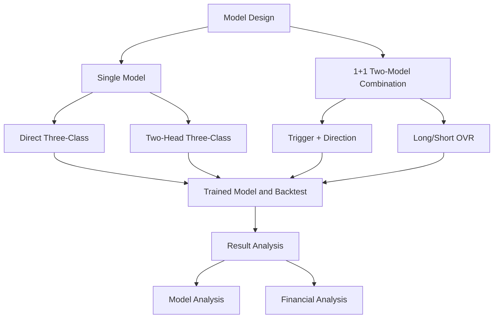

```mermaid
flowchart TD
    A[Model Design]

    A --> A1[Single Model]
    A1 --> A11[Direct Three-Class]
    A1 --> A12[Two-Head Three-Class]

    A --> A2[1+1 Two-Model Combination]
    A2 --> A21[Trigger + Direction]
    A2 --> A22[Long/Short OVR]

    A11 --> B[Trained Model and Backtest]
    A12 --> B
    A21 --> B
    A22 --> B

    B --> C[Result Analysis]
    C --> C1[Model Analysis]
    C --> C2[Financial Analysis]
```