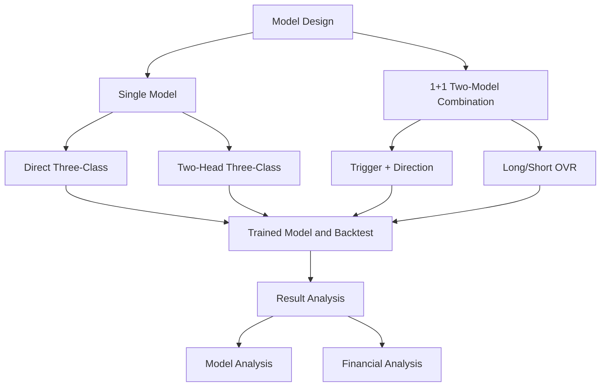

# architecture

***************Model******************
•	Convolution Neural Networks
•	Recurrent Neural Networks (RNN)
•	Deep Autoencoders (unsupervised learning)
•	GAN (2014)
•	Deep Forrest (2017)
•	Transformer (GPT3, 2020)

--------------------Problem---------------------------
*Should early stopping follow va_loss or va_macroF1? How to choose
    Should a trading proxy metric be used during validation as well?
*unbalanced class

*tr_loss training loss
*va_loss validation loss
*va_macroF1 harmonic mean of precision + recall, 0 = pure guessing, 1 = perfect classification.
    Rules of thumb:
    Random (multi-class): ~ 0.2~0.25
    Barely useful: >0.3
    Some signal: >0.35
    Fairly strong: >0.45
Overfitting: va_loss >> tr_loss and va_macroF1 does not rise while tr_loss falls -- the model learned the training set's patterns / noise
Feed part of the magnitude information into the loss function and see whether the model can learn more
