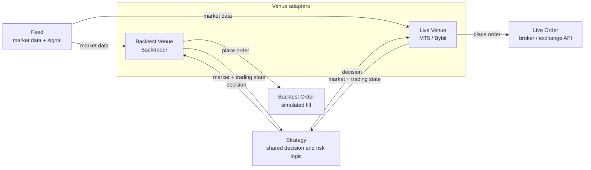

# Trading architecture: one strategy, multiple venues

`Venue` is the adapter between a reusable strategy and a concrete trading environment.
The feed supplies market data to the venue; the venue passes market and trading state to
the strategy, receives its decision, and converts that decision into an order.

## How Venue adapts backtest and live trading

| Component | Backtest | Live trading |
| --- | --- | --- |
| Feed | historical data and offline prediction | exchange klines and online inference |
| Venue | `BtVenue` reads simulated state and drives Backtrader orders | `MT5Venue`/`BybitVenue` reads live state and calls broker APIs |
| Strategy | shared strategy and configuration | the same strategy and configuration |
| Order | simulated fill | real broker/exchange order |

The stable relationship is:

`Feed → Venue ↔ Strategy → Venue → Order`

`Venue` absorbs the environmental differences: bar driving, position and equity state,
order conversion, fills, precision, and error handling. Strategy code remains independent
of whether its venue is a backtest engine or a live broker.

Current migration status: `venue/live/ftmo/market_ml.py` is the reference live path and
constructs the full `Observation`. `venue/live/bybit/bybit_turtle.py` still calls the old
`strategy.process(df=...)` signature, so the Bybit turtle path is not yet fully on the shared
protocol.

## Parameter ownership

Parameters are split by the layer that owns their meaning:

- `trade.strategy.*StrategyConfig`: decision parameters only, such as holding bars, signal thresholds, risk budget and grid rules.
- `trade.runner.config.BrokerConfig`: initial equity, commission and leverage.
- `ModelDataConfig` / `CsvDataConfig`: model artifact paths, symbol, interval and date range.
- `BacktestEngineConfig`: Backtrader execution switches.

`RunnerConfig` and an explicit period are the inputs to
`backtest_runner.main(logger, config, period)`. Its configuration fields are
grouped by owner: `strategy_config`, `broker_config`, `data_config`, `engine_config` and
`report_config`. The concrete data config type selects the pipeline: `ModelDataConfig` loads
prepared data, model artifacts and predictions internally; `CsvDataConfig` loads raw market
data internally. Callers never load a DataFrame or model and pass it into the runner.

`MarketDataSourceConfig` is the common raw-data locator shared by `BaseDefine` and
`CsvDataConfig`: `market_category / data_source / trading_type / symbol_interval.csv`.
`atr_ref_bars` is required in both data configs. `bars_to_close` is an optional feed column;
when it is absent, the observation uses infinity to represent a continuous market with no close.

`create_backtest_cerebro()` is the common execution skeleton. It installs the same broker,
Sharpe/Returns/DrawDown/TradeAnalyzer/CusAnalyzer set for ML and non-ML runs, and passes
the strategy-owned config to a `*BtVenue` as one opaque `strategy_config` object. The venue
understands the concrete type and constructs the strategy; the runner never expands strategy
fields. `generate_backtest_report()` is shared as well, so return, drawdown, rolling Calmar,
exposure and trade metrics use one implementation.

`backtest_runner.StrategyPara` is a small experiment bundle containing `strategy_config` and
`broker_config` directly. It performs no field copying or config conversion.

Naming convention: strategy classes `*Strategy` (`MlSignalStrategy` / `RestartableMartingaleStrategy`),
backtest venue classes `*BtVenue` (`MlBtVenue` / `MartingaleBtVenue`), live venue classes `*Venue` (`BybitVenue` / `MT5Venue`).
`strategy.finalize()` settles the strategy side, `venue.stop()` ends the venue life cycle (BtVenue calls the former automatically).

`Observation` is split by origin: `obs.market.*` (what the feed can compute on its own) / `obs.position.*` / `obs.account.*` (known only to the venue).
On the backtest side `BtVenue.observe()` assembles it, subclasses no longer write it by hand.

Parameter naming convention `<meaning>_<unit>`:
`_pct` ratio (0-1, e.g. risk_per_trade_pct / death_equity_pct) · `_bars` bar count (fixed_hold_bars / max_hold_bars) ·
`_mult` multiplier (atr_sl_long_mult / atr_tp_mult / volume_mult) · `_days` days (pause_days).
Counters carry no suffix (max_safety_orders / max_layers). Exception: `predict_num` is a data_process preprocessing concept and keeps its original name.

---

Improve the profit/loss ratio, reduce the drawdown, raise the Sharpe ratio.
Set a sensible stop loss from the statistics of the adverse excursion on correct up/down predictions, filtering FPs while reducing the drawdown of the TPs.
*Position sizing:
    - the only method that works so far is lowering the size based on the backtest data to satisfy the risk limits
    sizing from the result of the last n trades (average return) works for trend strategies   *the statistics show no correlation
    cut the size sharply during a losing streak.      *the statistics show no correlation
*Reducing the drawdown
    the best known method is still raising the threshold and only taking the high confidence trades.
*FTMO
    Consider the case where the stop loss fails to execute and breaks the 5% daily / 10% maximum loss limits
    pip install MetaTrader5
    **Measure the price correlation between instruments and lower the risk by trading several of them
    Strategy:
    -- when to close?
        The current strategy closes when a choppy or reversal signal is detected. Try not closing on chop within hold_bar, on the grounds that the previous prediction is still valid.
        Run high risk / high return strategies small (e.g. CAGR 1000% with a 40% drawdown); with a large size risk control comes first and the return second
        The FTMO limits must hold: 5% daily loss (kept under 3.5%) and 10% total loss (kept under 8%). The high risk share can be raised on a good day and shrunk/disabled on a bad one
        The current strategy works in persistently trending markets (BTC/ETH) and fails completely on DOGE

# Restartable Martingale
A new martingale variant that leans on the fat tail character of the market. The capital is split into trading capital and reserve capital. The trading capital earns in normal regimes and its profit is periodically moved into the reserve; in an extreme regime the trade account is allowed to stop out or be wiped out, and the reserve then funds a restart.

Its theoretical edge: **the profit accumulated and isolated in normal regimes before the tail event exceeds the loss of one death plus the restart cost.**

[
E[\text{profit swept before death}]>
E[\text{death loss}+\text{restart cost}]
]
